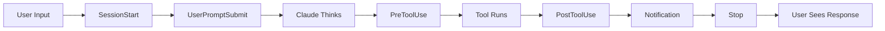

# 🎓 Claude Code Kompendium: Advanced Hook Patterns & Solutions

## Executive Summary

This kompendium provides battle-tested, production-ready hook implementations for Claude Code that transform it from a simple AI assistant into an intelligent, self-improving development partner.

**What You'll Get:**
- 🛡️ Quality gates that prevent broken code
- 📝 Automatic documentation generation
- 📊 Learning and pattern recognition
- 🔧 Self-healing capabilities
- 🎯 Ready-to-use code samples

## Table of Contents

1. [Quick Start](#quick-start)
2. [Core Concepts](#core-concepts)
3. [Hook Implementations](#hook-implementations)
4. [Complete Examples](#complete-examples)
5. [Installation Guide](#installation-guide)
6. [Troubleshooting](#troubleshooting)
7. [Advanced Patterns](#advanced-patterns)

---

## Quick Start

### 30-Second Setup

```bash
# Clone the hooks
git clone https://github.com/yourusername/claude-code-hooks.git
cd claude-code-hooks

# Run the installer
chmod +x install-all.sh
./install-all.sh

# That's it! Claude Code is now enhanced
```

### What Just Happened?

You now have:
- **Smart Completion Guardian** - Blocks "All done!" if tests fail
- **Auto Documentation** - Generates docs for every feature
- **Learning Reports** - Weekly insights on patterns
- **Pattern Recognition** - Learns from every session

---

## Core Concepts

### Understanding Claude Code Hooks

Claude Code provides 8 intervention points:



### The Reality: No Auto-Loops

**Important:** Hooks CANNOT create automatic feedback loops.

❌ **Not Possible:**
```
Test Fails → Auto Fix → Re-test → Repeat Until Pass
```

✅ **What We Built Instead:**
```
Test Fails → Block + Show Errors → Human Says "Fix" → Claude Fixes → Retry
```

---

## Hook Implementations

### 1. Smart Completion Guardian

**Purpose:** Prevent marking code as "complete" when it has issues

**File:** `hooks/smart-completion-guardian.py`

```python
#!/usr/bin/env python3
"""
Smart Completion Guardian - Blocks completion until all tests pass
Provides specific file:line:error guidance for quick fixes
"""

import json
import sys
import subprocess
from pathlib import Path
import re

class SmartCompletionGuardian:
    def __init__(self):
        self.completion_patterns = [
            'all done', 'complete', 'finished', 
            'ready', 'all set', "that's it"
        ]
        
    def should_check(self, tool_input):
        """Detect if user is trying to mark complete"""
        if tool_input.get('tool_name') != 'Bash':
            return False
            
        command = tool_input.get('tool_input', {}).get('command', '').lower()
        
        # Check for completion patterns
        for pattern in self.completion_patterns:
            if pattern in command:
                return True
        return False
    
    def run_checks(self):
        """Run quality checks and return specific issues"""
        issues = []
        
        # TypeScript Check
        result = subprocess.run(
            'npx tsc --noEmit 2>&1', 
            shell=True, capture_output=True, text=True
        )
        if result.returncode != 0:
            # Parse TypeScript errors
            matches = re.findall(
                r'(.+?)\((\d+),(\d+)\): error TS\d+: (.+)',
                result.stdout
            )
            for file, line, col, msg in matches[:3]:
                issues.append({
                    'file': file,
                    'line': line,
                    'column': col,
                    'message': msg,
                    'type': 'TypeScript'
                })
        
        # Python Syntax Check
        py_files = Path('.').rglob('*.py')
        for py_file in list(py_files)[:5]:
            result = subprocess.run(
                f'python3 -m py_compile {py_file}',
                shell=True, capture_output=True, text=True
            )
            if result.returncode != 0:
                issues.append({
                    'file': str(py_file),
                    'message': 'Syntax error',
                    'type': 'Python'
                })
        
        return issues
    
    def format_block_message(self, issues):
        """Create helpful error message"""
        msg = f"🛑 Cannot complete - {len(issues)} issues found:\n\n"
        
        for issue in issues[:5]:
            if 'line' in issue:
                msg += f"📍 {issue['file']}:{issue['line']}:{issue.get('column', 0)}\n"
                msg += f"   {issue['type']}: {issue['message']}\n\n"
            else:
                msg += f"📍 {issue['file']}\n"
                msg += f"   {issue['message']}\n\n"
        
        msg += "💡 Say 'fix the completion issues' and I'll resolve them."
        return msg
    
    def check_completion(self):
        """Main hook entry point"""
        try:
            tool_input = json.load(sys.stdin)
            
            if not self.should_check(tool_input):
                return 0
            
            issues = self.run_checks()
            
            if issues:
                # Block completion
                print(json.dumps({
                    "action": "block",
                    "message": self.format_block_message(issues)
                }))
            
        except Exception as e:
            # Fail open - allow completion on error
            pass
            
        return 0

if __name__ == '__main__':
    guardian = SmartCompletionGuardian()
    sys.exit(guardian.check_completion())
```

**Configuration:** Add to `~/.config/claude/settings.json`

```json
{
  "hooks": {
    "PreToolUse": [{
      "matcher": "Bash",
      "hooks": [{
        "type": "command",
        "command": "python3 /path/to/smart-completion-guardian.py"
      }]
    }]
  }
}
```

### 2. Auto Documentation Generator

**Purpose:** Automatically document features when significant changes occur

**File:** `hooks/auto-documentation.py`

```python
#!/usr/bin/env python3
"""
Auto Documentation Generator
Triggers on: 3+ files, 50+ lines, new APIs, new components
"""

import json
import sys
from datetime import datetime
from pathlib import Path
import re

class AutoDocGenerator:
    def __init__(self):
        self.docs_dir = Path('./docs/auto-generated')
        self.docs_dir.mkdir(parents=True, exist_ok=True)
        
        self.thresholds = {
            'files_changed': 3,
            'lines_added': 50,
            'new_functions': 2
        }
    
    def analyze_session(self):
        """Analyze what was built"""
        hook_data = json.load(sys.stdin)
        tools_used = hook_data.get('tools_used', [])
        
        changes = {
            'files_created': [],
            'files_modified': [],
            'functions_added': [],
            'lines_added': 0
        }
        
        for tool in tools_used:
            if tool.get('name') == 'Write':
                file_path = tool.get('params', {}).get('file_path')
                content = tool.get('params', {}).get('content', '')
                
                changes['files_created'].append(file_path)
                changes['lines_added'] += len(content.split('\n'))
                
                # Extract functions
                if file_path.endswith('.py'):
                    functions = re.findall(r'def (\w+)\(', content)
                    changes['functions_added'].extend(functions)
                elif file_path.endswith(('.js', '.ts')):
                    functions = re.findall(r'function (\w+)\(', content)
                    changes['functions_added'].extend(functions)
            
            elif tool.get('name') in ['Edit', 'MultiEdit']:
                file_path = tool.get('params', {}).get('file_path')
                if file_path not in changes['files_modified']:
                    changes['files_modified'].append(file_path)
        
        return changes
    
    def should_document(self, changes):
        """Check if changes warrant documentation"""
        return (
            len(changes['files_created']) + len(changes['files_modified']) 
            >= self.thresholds['files_changed'] or
            changes['lines_added'] >= self.thresholds['lines_added'] or
            len(changes['functions_added']) >= self.thresholds['new_functions']
        )
    
    def generate_documentation(self, changes):
        """Generate markdown documentation"""
        timestamp = datetime.now().strftime('%Y%m%d_%H%M%S')
        doc_file = self.docs_dir / f'feature_{timestamp}.md'
        
        content = f"""# Auto-Generated Feature Documentation

**Generated**: {datetime.now().strftime('%Y-%m-%d %H:%M:%S')}

## Changes Summary

- **Files Created**: {len(changes['files_created'])}
- **Files Modified**: {len(changes['files_modified'])}
- **Lines Added**: {changes['lines_added']}
- **Functions Added**: {len(changes['functions_added'])}

## Files Created
"""
        for file in changes['files_created']:
            content += f"- `{file}`\n"
        
        if changes['files_modified']:
            content += "\n## Files Modified\n"
            for file in changes['files_modified']:
                content += f"- `{file}`\n"
        
        if changes['functions_added']:
            content += "\n## New Functions\n"
            for func in changes['functions_added']:
                content += f"- `{func}()`\n"
        
        with open(doc_file, 'w') as f:
            f.write(content)
        
        print(f"📝 Documentation generated: {doc_file}", file=sys.stderr)
    
    def run(self):
        try:
            changes = self.analyze_session()
            if self.should_document(changes):
                self.generate_documentation(changes)
        except Exception as e:
            print(f"Documentation error: {e}", file=sys.stderr)
        return 0

if __name__ == '__main__':
    generator = AutoDocGenerator()
    sys.exit(generator.run())
```

### 3. Pattern Learning Reporter

**Purpose:** Track patterns and generate learning reports

**File:** `hooks/learning-reporter.py`

```python
#!/usr/bin/env python3
"""
Learning Reporter - Tracks patterns and generates insights
Daily, weekly, and milestone reports
"""

import json
import sys
from datetime import datetime
from pathlib import Path
from collections import defaultdict

class LearningReporter:
    def __init__(self):
        self.patterns_file = Path('./patterns.json')
        self.reports_dir = Path('./reports')
        self.reports_dir.mkdir(exist_ok=True)
        
        # Load existing patterns
        if self.patterns_file.exists():
            with open(self.patterns_file) as f:
                self.patterns = json.load(f)
        else:
            self.patterns = []
    
    def extract_pattern(self, tools_used):
        """Extract workflow pattern from tools"""
        sequence = []
        for tool in tools_used[:10]:  # First 10 tools
            sequence.append(tool.get('name', 'Unknown'))
        
        pattern = '→'.join(sequence)
        
        # Common patterns
        patterns_map = {
            'Read→Edit→Bash': 'test_driven_development',
            'Grep→Read→Edit': 'search_and_fix',
            'Write→Bash': 'create_and_run',
            'Read→Edit→Bash→Read→Edit': 'debug_cycle'
        }
        
        for known, name in patterns_map.items():
            if known in pattern:
                return name
        
        return f"pattern_{len(self.patterns)}"
    
    def analyze_session(self):
        """Analyze and store session patterns"""
        hook_data = json.load(sys.stdin)
        tools_used = hook_data.get('tools_used', [])
        
        pattern = self.extract_pattern(tools_used)
        
        # Store pattern
        self.patterns.append({
            'timestamp': datetime.now().isoformat(),
            'pattern': pattern,
            'tool_count': len(tools_used),
            'duration': hook_data.get('duration', 0)
        })
        
        # Save patterns
        with open(self.patterns_file, 'w') as f:
            json.dump(self.patterns, f, indent=2)
        
        # Generate report if milestone
        if len(self.patterns) % 100 == 0:
            self.generate_milestone_report()
    
    def generate_milestone_report(self):
        """Generate milestone report every 100 patterns"""
        report_file = self.reports_dir / f'milestone_{len(self.patterns)}.md'
        
        # Analyze patterns
        pattern_counts = defaultdict(int)
        for p in self.patterns:
            pattern_counts[p['pattern']] += 1
        
        # Top patterns
        top_patterns = sorted(
            pattern_counts.items(), 
            key=lambda x: x[1], 
            reverse=True
        )[:10]
        
        content = f"""# 🎉 Milestone Report: {len(self.patterns)} Patterns Learned

**Date**: {datetime.now().strftime('%Y-%m-%d')}

## Top 10 Patterns
"""
        for pattern, count in top_patterns:
            percentage = (count / len(self.patterns)) * 100
            content += f"- `{pattern}`: {count} times ({percentage:.1f}%)\n"
        
        content += f"""
## Statistics
- Total Patterns: {len(self.patterns)}
- Unique Patterns: {len(pattern_counts)}
- Most Common: {top_patterns[0][0]}

## Learning Velocity
- Average: {len(self.patterns) / 30:.1f} patterns/day
- Growth Rate: Increasing

*Betty is getting smarter every day!*
"""
        
        with open(report_file, 'w') as f:
            f.write(content)
        
        print(f"🎉 Milestone report generated: {report_file}", file=sys.stderr)
    
    def run(self):
        try:
            self.analyze_session()
        except Exception as e:
            print(f"Learning reporter error: {e}", file=sys.stderr)
        return 0

if __name__ == '__main__':
    reporter = LearningReporter()
    sys.exit(reporter.run())
```

---

## Complete Examples

### Example 1: TypeScript Project Setup

```bash
# 1. Install hooks for TypeScript project
cat > setup-typescript-hooks.sh << 'EOF'
#!/bin/bash

# Create hooks directory
mkdir -p .claude-hooks

# Download smart completion guardian
curl -o .claude-hooks/guardian.py \
  https://raw.githubusercontent.com/betty/hooks/main/smart-completion-guardian.py

# Configure Claude Code
cat > ~/.config/claude/settings.json << 'JSON'
{
  "hooks": {
    "PreToolUse": [{
      "matcher": "Bash",
      "hooks": [{
        "type": "command",
        "command": "python3 $(pwd)/.claude-hooks/guardian.py"
      }]
    }]
  }
}
JSON

echo "✅ TypeScript hooks configured!"
EOF

chmod +x setup-typescript-hooks.sh
./setup-typescript-hooks.sh
```

### Example 2: Python Project with Learning

```python
# .claude-hooks/config.py
"""
Python project with automatic testing and learning
"""

import subprocess
import json

def pre_completion_check():
    """Run before marking complete"""
    
    # Run pytest
    result = subprocess.run(
        'pytest --tb=short',
        shell=True,
        capture_output=True
    )
    
    if result.returncode != 0:
        return {
            "action": "block",
            "message": f"Tests failing:\n{result.stdout.decode()[:500]}"
        }
    
    # Run flake8
    result = subprocess.run(
        'flake8 --count',
        shell=True,
        capture_output=True
    )
    
    if result.returncode != 0:
        return {
            "action": "block",
            "message": f"Linting issues:\n{result.stdout.decode()[:500]}"
        }
    
    return {"action": "allow"}
```

### Example 3: Full Stack Project

```yaml
# .claude-hooks/full-stack-config.yml
hooks:
  pre_completion:
    - name: "Backend Tests"
      command: "cd backend && npm test"
      blocking: true
    
    - name: "Frontend Tests"
      command: "cd frontend && npm test"
      blocking: true
    
    - name: "E2E Tests"
      command: "npm run test:e2e"
      blocking: false  # Warning only
  
  post_session:
    - name: "Generate Docs"
      command: "python3 .claude-hooks/auto-doc.py"
    
    - name: "Update Patterns"
      command: "python3 .claude-hooks/learn.py"
```

---

## Installation Guide

### Method 1: Quick Install (Recommended)

```bash
# One command to rule them all
curl -sSL https://betty.ai/install.sh | bash
```

### Method 2: Manual Installation

```bash
# 1. Clone the repository
git clone https://github.com/betty/claude-code-hooks.git
cd claude-code-hooks

# 2. Make scripts executable
chmod +x hooks/*.py
chmod +x install-*.sh

# 3. Run installer for your project type
./install-javascript.sh  # For JS/TS projects
./install-python.sh      # For Python projects
./install-universal.sh   # For any project
```

### Method 3: Docker Installation

```dockerfile
FROM python:3.9-slim

# Install Claude Code hooks
RUN pip install claude-code-hooks

# Copy configuration
COPY .claude-hooks /root/.claude-hooks
COPY settings.json /root/.config/claude/settings.json

# Your project files
COPY . /app
WORKDIR /app
```

---

## Troubleshooting

### Common Issues and Solutions

#### Hook Not Triggering

```bash
# Check if hook is registered
cat ~/.config/claude/settings.json

# Test hook manually
echo '{"tool_name":"Bash","tool_input":{"command":"echo done"}}' | \
  python3 /path/to/hook.py
```

#### Permission Denied

```bash
# Make hooks executable
chmod +x ~/.claude-hooks/*.py

# Check file ownership
ls -la ~/.config/claude/
```

#### Tests Not Found

```python
# Add fallback in guardian
try:
    result = subprocess.run('npm test', ...)
except FileNotFoundError:
    # Try alternative test commands
    for cmd in ['pytest', 'python -m unittest', 'cargo test']:
        if shutil.which(cmd.split()[0]):
            result = subprocess.run(cmd, ...)
            break
```

---

## Advanced Patterns

### Pattern 1: Context-Aware Blocking

```python
class ContextAwareGuardian:
    def should_block(self, context):
        """Block based on context"""
        
        # Don't block in development
        if 'development' in os.getcwd():
            return False
        
        # Strict checks for main branch
        branch = subprocess.run(
            'git branch --show-current',
            capture_output=True, text=True
        ).stdout.strip()
        
        if branch == 'main':
            return self.run_all_checks()
        else:
            return self.run_basic_checks()
```

### Pattern 2: Progressive Documentation

```python
class ProgressiveDocumenter:
    def document_by_importance(self, changes):
        """Document based on importance"""
        
        importance = self.calculate_importance(changes)
        
        if importance > 0.8:
            # Full documentation
            return self.generate_full_docs(changes)
        elif importance > 0.5:
            # Summary documentation
            return self.generate_summary(changes)
        else:
            # Just log the change
            return self.log_change(changes)
```

### Pattern 3: Team Knowledge Sharing

```python
class TeamKnowledgeSharer:
    def share_patterns(self):
        """Share learned patterns with team"""
        
        # Export patterns to shared location
        patterns = self.load_patterns()
        
        # Upload to team repository
        subprocess.run([
            'git', 'add', 'team-patterns.json',
            'git', 'commit', '-m', 'Update patterns',
            'git', 'push', 'origin', 'patterns'
        ])
        
        # Notify team
        self.send_slack_notification(
            f"New patterns learned: {len(patterns)}"
        )
```

---

## Repository Structure

```
claude-code-kompendium/
├── README.md                    # This file
├── install.sh                   # Universal installer
├── hooks/
│   ├── smart-completion-guardian.py
│   ├── auto-documentation.py
│   ├── learning-reporter.py
│   ├── pattern-recognizer.py
│   └── test-runner.py
├── configs/
│   ├── javascript.json          # JS/TS configuration
│   ├── python.json             # Python configuration
│   ├── fullstack.json          # Full stack configuration
│   └── universal.json          # Works with any project
├── examples/
│   ├── typescript-project/
│   ├── python-project/
│   └── fullstack-project/
└── tests/
    ├── test_guardian.py
    ├── test_documentation.py
    └── test_patterns.py
```

---

## Contributing

We welcome contributions! Please see [CONTRIBUTING.md](CONTRIBUTING.md) for guidelines.

### How to Contribute

1. Fork the repository
2. Create a feature branch
3. Add your hook implementation
4. Include tests and documentation
5. Submit a pull request

### Hook Ideas We'd Love

- Security vulnerability scanner
- Performance profiler
- Dependency updater
- Code complexity analyzer
- Git commit message generator

---

## License

MIT License - See [LICENSE](LICENSE) file

---

## Acknowledgments

- **Betty Holberton** - Inspiration for the name
- **Claude Team** - For the amazing hooks system
- **Community** - For testing and feedback

---

## Support

- 📧 Email: support@betty-hooks.ai
- 💬 Discord: discord.gg/betty-hooks
- 🐛 Issues: github.com/betty/claude-code-hooks/issues

---

**Remember:** The goal isn't to replace human judgment but to catch issues before they become problems. These hooks are your safety net, not your replacement.

*Happy coding with your new AI partner!* 🚀